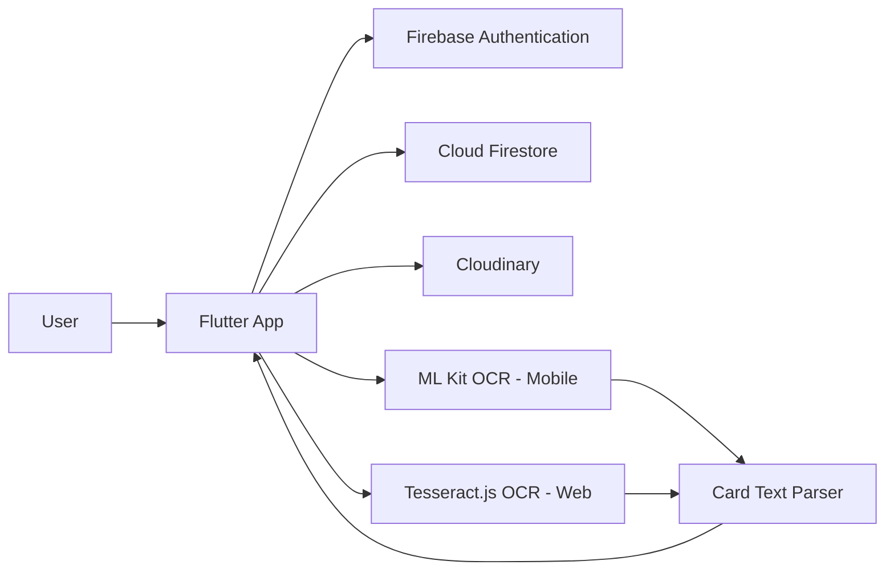
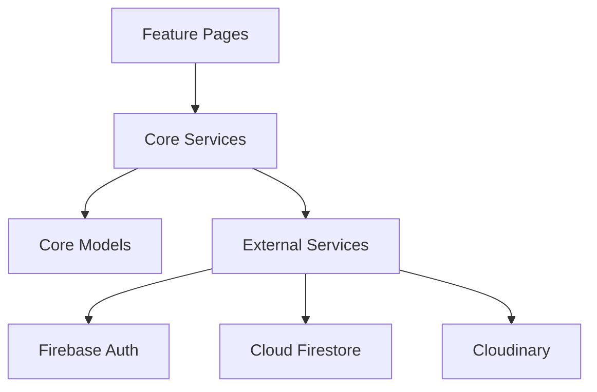
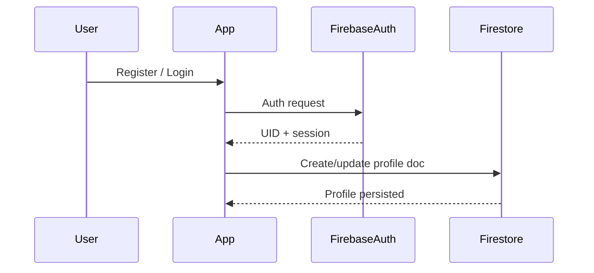
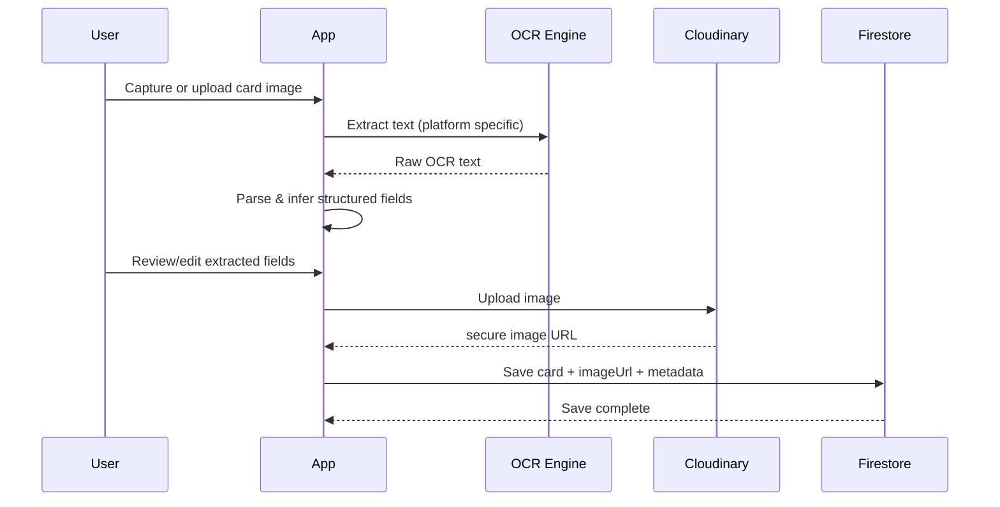
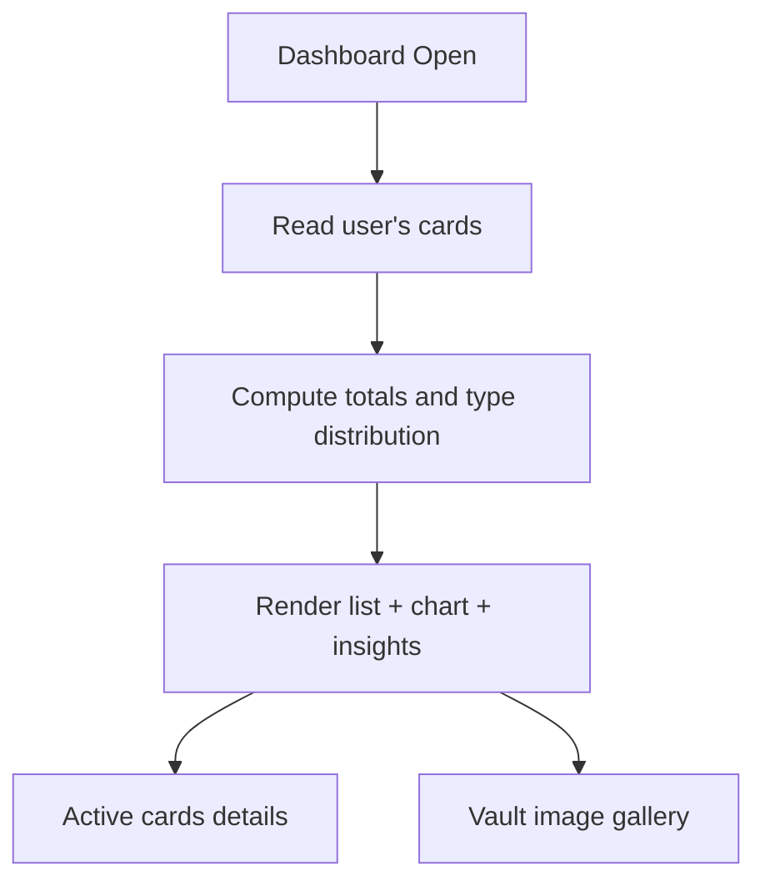

# ARCHITECTURE.md — CardVault

## 1) System goal

CardVault digitizes business cards by combining:

- image capture/upload,
- OCR-based field extraction,
- editable review,
- secure cloud persistence,
- dashboard analytics and card browsing.

It is designed as a Flutter-first client architecture with managed cloud services.

## 2) High-level architecture



## 3) Runtime architecture (client layers)



### 3.1 Feature layer (`lib/features/*`)

- `auth`: login/register flows and account onboarding
- `cards`: add/edit/list/details flows
- `dashboard`: overview, active cards, vault images, insights graph
- `settings`: editable profile + theme mode
- `splash`: session routing

### 3.2 Core layer (`lib/core/*`)

- `models`: `VaultCard`, `ExtractedCardData`, `UserProfile`
- `services`: OCR, parser, Firestore, storage, profile services
- `router`: centralized app navigation
- `widgets`: shared scaffolding, buttons, glass containers, capture modal
- `theme`: dark/light theme setup

## 4) Key data flows

## 4.1 Authentication flow



## 4.2 Capture/upload + OCR + save flow



## 4.3 Dashboard flow



## 5) OCR architecture

### Mobile

- `card_ocr_service_io.dart`
- Google ML Kit reads text from local image bytes.

### Web

- `card_ocr_service_web.dart` + `web/index.html`
- Tesseract.js runs multi-pass recognition on preprocessed image variants.

### Shared parser

- `card_text_parser.dart`
- Converts raw OCR text into:
  - person name
  - company
  - phone
  - email
  - website
  - address
  - business type

## 6) Storage architecture

### Identity and metadata

- Firebase Authentication: user identity/session
- Firestore:
  - `cards` documents
  - `users` profile documents

### Image assets

- Cloudinary stores card/profile images.
- Firestore stores URL pointer (`imageUrl`/`photoUrl`) for rendering.

## 7) Firestore model snapshot

### `cards` (representative fields)

- `userId`
- `personName`
- `companyName`
- `designation`
- `phoneNumber`
- `email`
- `website`
- `address`
- `businessType`
- `notes`
- `imageUrl`
- `createdAt`

### `users`

- `uid`
- `fullName`
- `email`
- `phone`
- `company`
- `photoUrl`
- `themeMode`

## 8) Security model

- User-bound data ownership through Firebase UID.
- Card/profile operations are scoped to authenticated user context.
- Intended Firestore rules pattern:

```text
allow read, write: if request.auth != null
                   && request.auth.uid == resource.data.userId;
```

## 9) Deployment model

- Client: Flutter app (web + mobile)
- Managed services:
  - Firebase Auth
  - Cloud Firestore
  - Cloudinary
- Optional extension:
  - OCR backend endpoint (future, for higher-accuracy server-side OCR)

## 10) Technical constraints and future improvements

Current constraints:

- OCR remains probabilistic on low-quality/angled images.
- Web camera/upload behavior depends on browser APIs.

Planned improvements:

- confidence-based field validation,
- perspective correction before OCR,
- server-side OCR fallback pipeline,
- improved search ranking and duplicate detection,
- CI checks and integration test suite.
