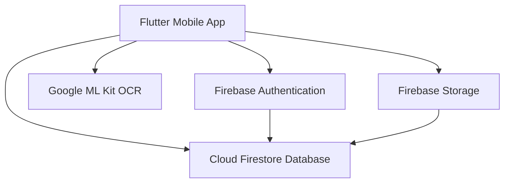
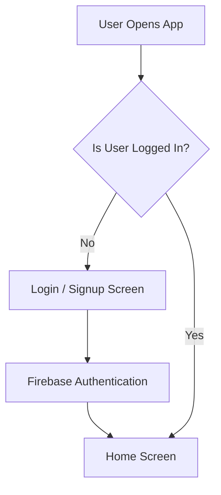
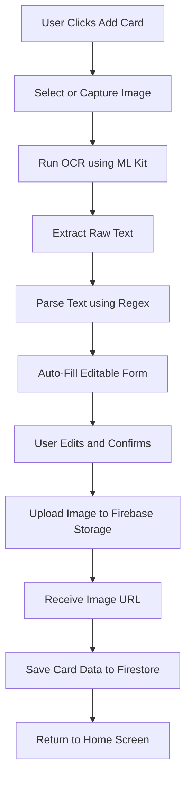
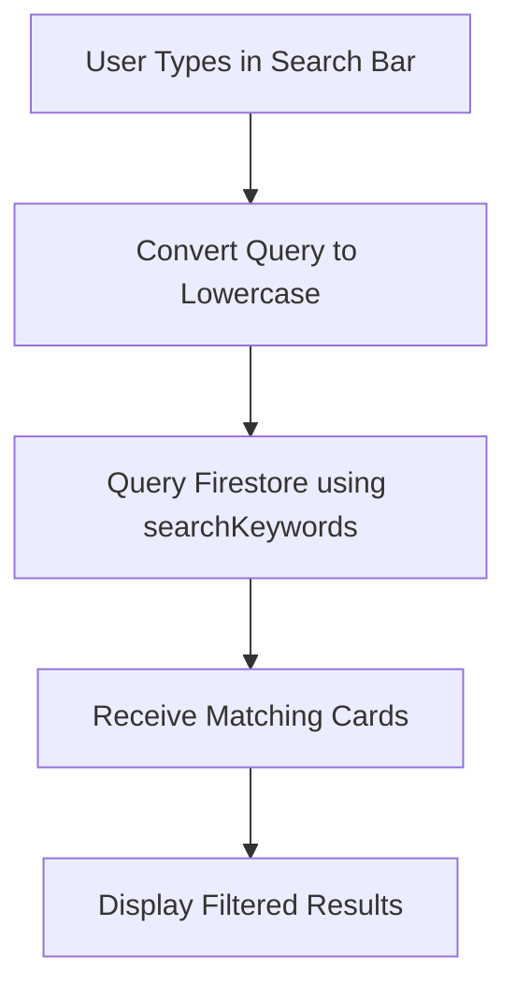

# ARCHITECTURE.md — CardVault (Visiting Card Manager)

## 1. Project Overview

CardVault is a Flutter-based mobile application that allows users to digitize and manage visiting cards. The application enables users to upload or capture an image of a visiting card, extract text using OCR, edit the extracted details, and store the structured information securely in Firebase.

The system is built without a custom backend server. Instead, it uses Firebase as a Backend-as-a-Service (BaaS), ensuring fast development, scalability, and secure data handling.

---

## 2. High-Level Architecture

---

## 3. System Components

### 3.1 Flutter Application
The Flutter app is responsible for:
- Rendering UI screens
- Handling user interaction
- Capturing or selecting card images
- Running OCR locally
- Displaying editable forms
- Performing search queries
- Communicating with Firebase services

---

### 3.2 Firebase Authentication
- Manages user login and registration.
- Generates a unique `userId` for each user.
- Ensures data isolation so users can only access their own cards.

---

### 3.3 Google ML Kit (On-Device OCR)
- Extracts text from visiting card images.
- Runs locally on the device.
- No external server call required.
- Reduces cost and improves speed.

---

### 3.4 Firebase Storage
- Stores uploaded visiting card images.
- Returns a public image URL.
- That URL is saved inside Firestore for future access.

---

### 3.5 Cloud Firestore
- Stores structured visiting card data.
- Uses document-based storage.
- Supports scalable querying.
- Enables keyword-based search.

---

## 4. Application Flow

### 4.1 Authentication Flow

---

### 4.2 Card Upload and OCR Flow

---

### 4.3 Search Flow

---

## 5. Firestore Data Model

Collection Name: `cards`

Each document structure:

cards/
   cardId/
      userId: string
      name: string
      company: string
      designation: string
      phoneNumbers: array
      emails: array
      address: string
      rawExtractedText: string
      imageUrl: string
      searchKeywords: array
      createdAt: timestamp

---

## 6. Search Strategy

To enable flexible searching across multiple fields:

When saving a card:
- All text fields are converted to lowercase.
- Words are split and stored in `searchKeywords` array.
- Includes name, company, phone numbers, emails, and extracted text.

Example:

searchKeywords:
[
  "john",
  "doe",
  "abc",
  "pvt",
  "ltd",
  "9876543210",
  "john@gmail.com"
]

Search query:

.where("searchKeywords", arrayContains: searchText)

This allows searching by:
- Name
- Company
- Phone
- Email
- Any keyword from OCR text

---

## 7. Security Model

Each card document contains:

userId = FirebaseAuth.currentUser.uid

Firestore Security Rule Concept:

allow read, write: if request.auth.uid == resource.data.userId;

This ensures:
- Users can only access their own cards.
- No cross-user data exposure.
- Secure multi-user architecture.

---

## 8. Folder Structure

lib/
 ├── main.dart
 ├── screens/
 │     ├── login_screen.dart
 │     ├── home_screen.dart
 │     ├── add_card_screen.dart
 │     ├── detail_screen.dart
 │     └── profile_screen.dart
 ├── services/
 │     ├── auth_service.dart
 │     ├── firestore_service.dart
 │     ├── storage_service.dart
 │     └── ocr_service.dart
 ├── models/
 │     └── card_model.dart
 ├── widgets/
 │     └── card_tile.dart

---

## 9. Scalability Considerations

Future improvements may include:
- AI-based smart field classification
- Duplicate card detection
- Contact export (.vcf)
- Cloud full-text search integration
- Tag-based grouping
- Contact sharing features

---

## 10. Engineering Principles Followed

- Clean separation of UI and business logic.
- Service-based architecture.
- Secure user data isolation.
- Editable OCR workflow before saving.
- Scalable Firestore structure.
- Modular and maintainable folder structure.

---

## Final Summary

CardVault replaces physical visiting cards with a digital, searchable, cloud-based system.

The architecture ensures:
- Secure authentication
- Structured storage
- Efficient search
- Editable OCR extraction
- Clean engineering practices
- Scalable Firebase-based backend

This design prioritizes clarity, maintainability, and scalability within a 4–5 day development timeline.
